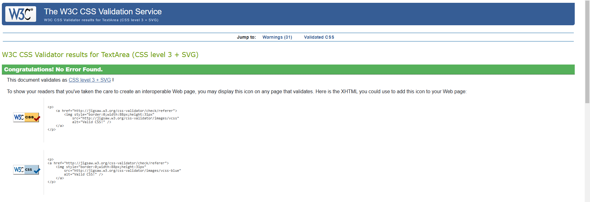
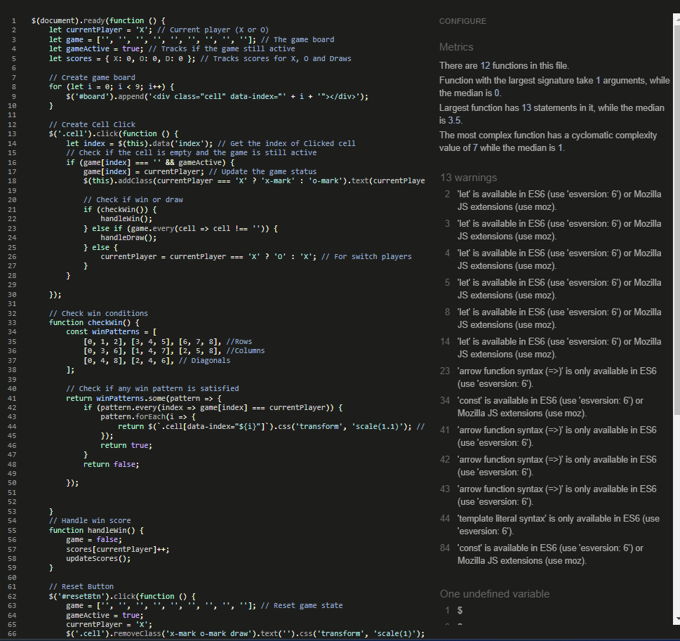

# Tic Tac Toe Game

This is fully responsive and interactive Tic Tac Toe game built using **HTML**, **CSS**, **JavaScript**, and **jQuery**.
it features a clean design, score tracking, and responsive layout that works on all screen sizes.

[Click here to start playing](https://saeed-l5.github.io/tic-tac-toe/)

## Features
1. **Interactive Gameplay**:
   - Play Tic Toc Toe with two players (X and O).
   - Track scores for X, O and Draws.
   - Reset the game at any time.

2. **Responsive Design**:
   - Work seamlessly on mobile, tablet, and desktop screens.
   - Adjusts cell sizes and font sizes for smaller screens.

3. **Navigation**:
   - Switch between the **Home** (game) and **Info** pages.
   - Learn about the game's history and rules on Info page.

4. **Modern UI**:
   - Gradient background for clean look.
   - Smooth animations and hover effects.

   

## How to Play
1. players take turns clicking on the cells to place their mark (X or O).
2. The first player to get three of their marks in a row (horizontal, vertical or diagonal) wins.
3. If all cells are filled without a winner, the game ends in a draw.

## Files
- **index.html**: The main HTML file containing the structure of the game.
- **style.css**: The CSS file for styling the game and making it responsive.
- **script.js**: The JavaScript file for game logic and interactivity.

## Technologies Used
- HTML
- CSS
- JavaScript
- jQuery
- Bootstrap

## Test
1. Accessibility
- I ran the website through Lighthouse and confirmed that the colors and font are easy to read and the website is accessible.

2. HTML
- I ran the website link through [HTML Validator](https://validator.w3.org/nu/) no errors to show.

3. CSS
- I ran the CSS code through [CSS Validator](https://jigsaw.w3.org/css-validator/) no errors to show.

4. JavaScript
- I ran the JavaScript code through [JShint](https://jshint.com/) no errors to show.

 
 

 ## Deployment
The following steps were taken to deploy the website using Github pages:
1. Within the Github repository, click on **Settings** in the top navigation bar
2. Choose **Pages** in the left navigation menu
3. In the source section, choose **Deploy from branch**
4. In the branch section, choose main and click **Save**

The following git command been used:
1. git add . - to add the files to the staging area before being committed.
2. git commit -m "commit message" - to commit changes to the local repository queue that are ready for the final step.
3. git push - to push all committed code to the remote repository on Github.

Cloning of the Repository Code locally
1. Go to the Github repository that you want to clone
2. Click on the Code button located above all the project files
3. Click on HTTPS and copy the repository link
4. Open new file in VS code and name it the same as repository
5. Open new terminal and use git clone copied link  . 
6. The project is now created as a local clone

## Credit
- special thank to my mentor Spencer Barriball for the support, help with troubleshooting, and answering all my Questions. He has been a great help on the way!

   
