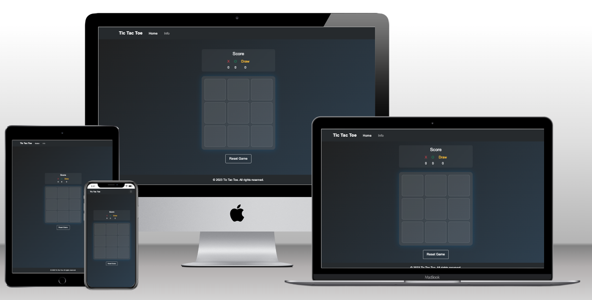
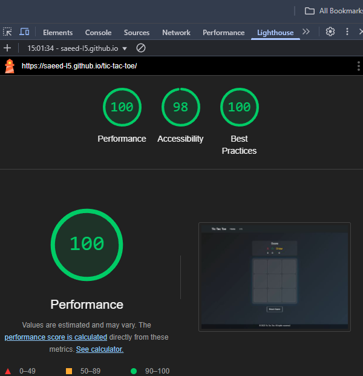
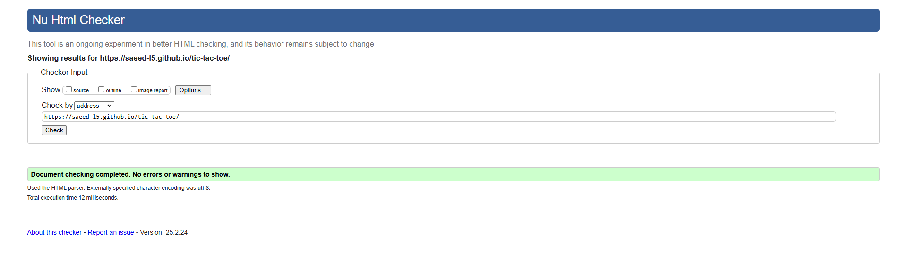

# Tic Tac Toe Game

This is fully responsive and interactive Tic Tac Toe game built using **HTML**, **CSS**, **JavaScript**, and **jQuery**.
it features a clean design, score tracking, and responsive layout that works on all screen sizes.

---

## Features
1. **Interactive Gameplay**:
   - Play Tic Toc Toe with two players (X and O).
   - Track scores for X, O and Draws.
   - Reset the game at any time.

2. **Responsive Design**:
   - Work seamlessly on mobile, tablet, and desktop screens.
   - Adjusts cell sizes and font sizes for smaller screens.

3. **Navigation**:
   - Switch between the **Home** (game) and **Info** pages.
   - Learn about the game's history and rules on Info page.

4. **Modern UI**:
   - Gradient background for clean look.
   - Smooth animations and hover effects.

   ---

## How to Play
1. players take turns clicking on the cells to place their mark (X or O).
2. The first player to get three of their marks in a row (horizontal, vertical or diagonal) wins.
3. If all cells are filled without a winner, the game ends in a draw.

---

## Files
- **index.html**: The main HTML file containing the structure of the game.
- **style.css**: The CSS file for styling the game and making it responsive.
- **script.js**: The JavaScript file for game logic and interactivity.

---

## Technologies Used
- HTML
- CSS
- JavaScript
- jQuery
- Bootstrap

---

## Test
1. Accessibility
- I ran the website through Lighthouse and confirmed that the colors and font are easy to read and the website is accessible.

2. HTML
- Iran the website link through [HTML Validator](https://validator.w3.org/detailed.html) no errors to show.

   
